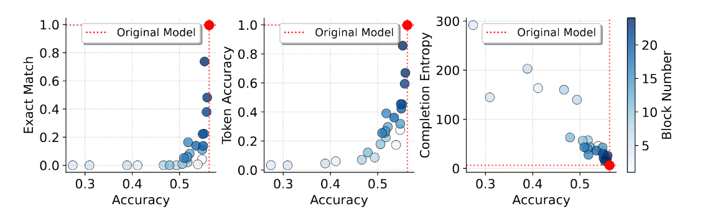
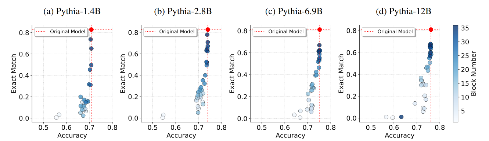
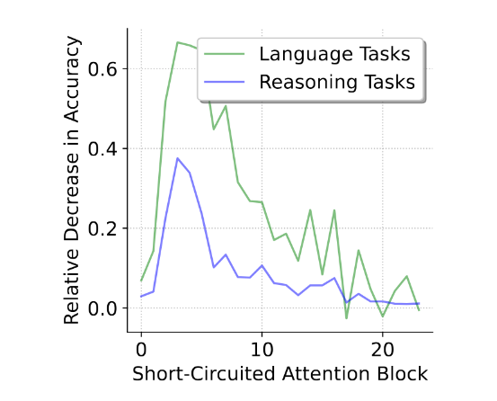

# Thread: "Analyzing Memorization in LLMs through Model Attribution" 🧠🔍

1/8 **JUST ANNOUNCED: Our paper on LLM memorization architecture has been accepted for oral presentation at NAACL 2025!** We're excited to share how we analyzed which components of transformer models contribute to training data memorization.

2/8 **Background**: LLMs often memorize portions of their training data verbatim, causing privacy breaches when they reproduce personal information (names, emails, phone numbers) and raising copyright concerns. This memorization happens despite using massive datasets where any single example represents a tiny fraction of training data. 
> May need a figure here

3/8 While prior research focused on extracting memorized content or developing post-hoc metrics, we take a fundamentally different approach by investigating which architectural components are actually responsible for this memorization behavior in transformer models. 

4/8 **Our method**: We systematically "short-circuit" attention modules at specific transformer blocks while preserving layer normalization and MLP operations. This reveals that attention modules in deeper transformer blocks are primarily responsible for memorization, while earlier blocks handle generalization and reasoning. When bypassing attention in later blocks, memorization dropped significantly with minimal impact on performance.

5/8 Our theoretical contribution provides rigorous mathematical bounds on the difference in model outputs with standard vs. short-circuited attention. We prove that early-layer interventions create differences that propagate and amplify through the network, while later-layer changes remain more localized - explaining why early blocks are crucial for general capabilities. 

6/8 We validated these findings across multiple model families (Pythia and GPT-Neo) spanning a wide range of parameter counts (1.3B to 12B) and diverse benchmark datasets, confirming our theoretical predictions across model scales and architectures.

7/8 Short-circuiting early layers caused complete model collapse, confirming these are essential for semantic processing. Interestingly, models showed almost zero performance drop on reasoning tasks when certain later blocks were modified - these blocks contribute almost exclusively to memorization!

8/8 Real-world impact: Our findings offer a practical approach to develop LLMs that maintain reasoning abilities while significantly reducing privacy and copyright risks. This creates a path toward more trustworthy AI deployment in sensitive domains like healthcare, legal services, and enterprise applications. Full paper: https://github.com/AikyamLab/llm-memorization

